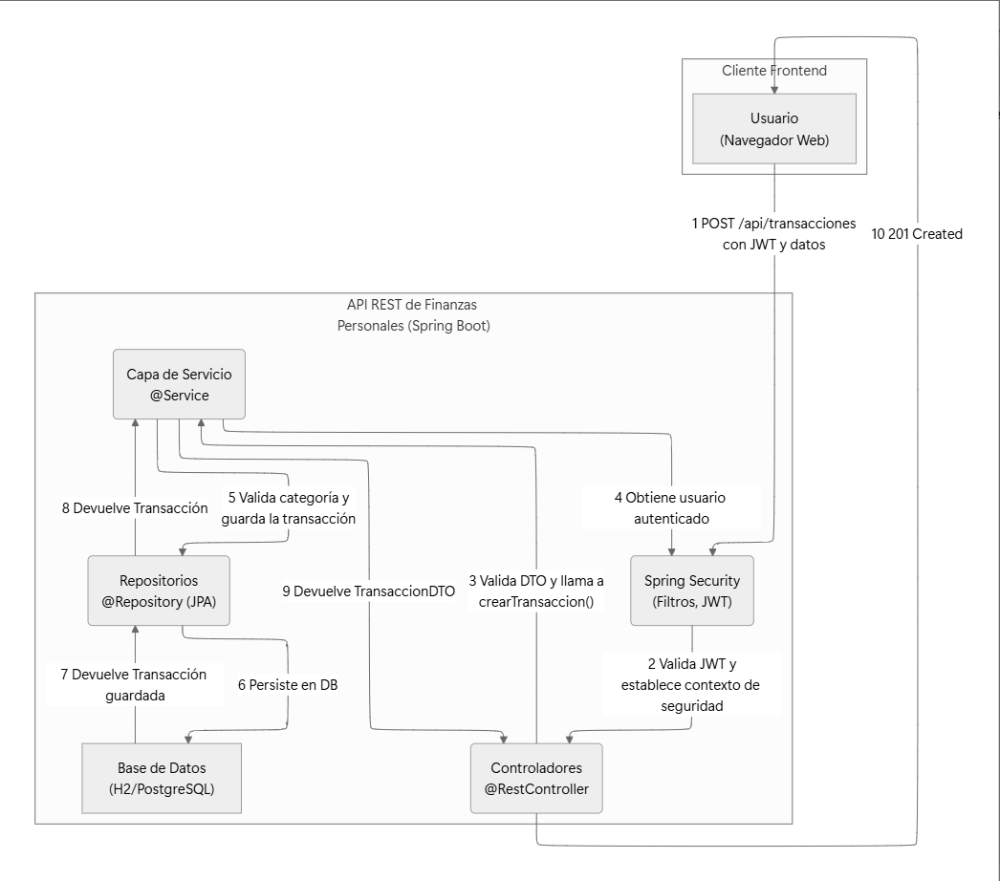

# **API REST de Finanzas Personales**

Un backend robusto y seguro construido con Spring Boot para una aplicación de gestión de finanzas personales. El proyecto permite a los usuarios registrarse, autenticarse y gestionar sus ingresos y gastos a través de una API RESTful bien definida.

## **✨ Características Principales**

- **Seguridad Basada en JWT:** Implementa un flujo de autenticación y autorización moderno utilizando JSON Web Tokens (JWT), asegurando cada endpoint con Spring Security.
- **Arquitectura Limpia y en Capas:** Sigue un diseño clásico y mantenible (Controlador, Servicio, Repositorio) que promueve la separación de responsabilidades y la testabilidad.
- **Gestión de Datos Multi-inquilino (Multi-tenancy):** La capa de servicio garantiza un estricto aislamiento de datos, asegurando que un usuario solo pueda acceder y modificar su propia información financiera.
- **Configuración por Perfiles:** Utiliza perfiles de Spring (`dev`, `prod`) para gestionar diferentes configuraciones de entorno, facilitando el desarrollo local y el despliegue a producción.
- **Persistencia con JPA:** Usa Spring Data JPA e Hibernate para el mapeo objeto-relacional, con soporte para bases de datos H2 (desarrollo) y PostgreSQL (producción).
- **Documentación de API Autogenerada:** Integra Springdoc OpenAPI para generar una interfaz de usuario Swagger, permitiendo una fácil visualización y prueba de la API.
- **Validación de Datos:** Aplica validaciones a nivel de DTO para garantizar la integridad de los datos que ingresan al sistema.

## **🏛️ Arquitectura del Sistema**

Los siguientes diagramas ilustran los dos flujos principales de la aplicación: la autenticación de un usuario y la creación de una transacción financiera, que es una operación protegida.

### **Flujo de Autenticación de Usuario**

Este diagrama muestra cómo un usuario intercambia sus credenciales por un token JWT que le permitirá acceder a las partes seguras de la API.


### **Flujo de Creación de Transacción (Operación Protegida)**

Una vez autenticado, el cliente utiliza el token JWT para realizar operaciones seguras. Este diagrama ilustra cómo se crea una nueva transacción, donde Spring Security valida el token antes de permitir que la petición llegue al controlador.



### **Flujo Completo de la aplicacion**


## **🛠️ Tecnologías Utilizadas**

- **Lenguaje:** Java 17
- **Framework Principal:** Spring Boot 3
- **Persistencia:** Spring Data JPA, Hibernate
- **Seguridad:** Spring Security, JWT (jjwt library)
- **Base de Datos:** H2 (para desarrollo), PostgreSQL (para producción)
- **API & Web:** Spring Web (MVC)
- **Validación:** Spring Boot Starter Validation (Hibernate Validator)
- **Documentación API:** Springdoc OpenAPI (Swagger UI)
- **Mapeo de Objetos:** MapStruct
- **Utilidades:** Lombok
- **Gestión de Dependencias:** Maven

## **🚀 Cómo Empezar**

Sigue estos pasos para tener una copia del proyecto funcionando en tu máquina local.

### **Prerrequisitos**

- JDK 17 o superior.
- Apache Maven 3.6+
- Para el perfil de desarrollo (`dev`), no se necesita una base de datos externa, ya que utiliza la base de datos en memoria H2.

### **Instalación**

1. **Clona el repositorio:**

    ```
    git clone https://github.com/tu-usuario/finanzas-personales.git
    
    ```

2. **Navega al directorio del proyecto:**

    ```
    cd finanzas-personales
    
    ```


## **⚙️ Configuración de Entorno**

El proyecto utiliza un sistema de perfiles para gestionar la configuración.

- `src/main/resources/application.properties`: Activa el perfil `dev` por defecto y contiene propiedades comunes.
- `src/main/resources/application-dev.properties`: Configuración para el desarrollo local. Usa una base de datos H2 en memoria y habilita logs de SQL para facilitar la depuración.
- `src/main/resources/application-prod.properties`: Configuración para producción. Apunta a una base de datos PostgreSQL y espera que los secretos (usuario, contraseña de la BD, clave JWT) se proporcionen como variables de entorno para máxima seguridad.

Para el desarrollo local, no se necesita ninguna configuración adicional.

## **🏃 Ejecución de la Aplicación**

- **Para ejecutar la aplicación en modo de desarrollo:**

    ```
    mvn spring-boot:run
    
    ```

  La API estará disponible en `http://localhost:8080`. La consola de la base de datos H2 estará en `http://localhost:8080/h2-console` (URL JDBC: `jdbc:h2:mem:finanzasdb`). La documentación de la API (Swagger UI) estará en `http://localhost:8080/swagger-ui.html`.

- **Para construir el archivo JAR para producción:**

    ```
    mvn clean package
    
    ```

  Luego puedes ejecutar el JAR activando el perfil de producción y proporcionando las variables de entorno necesarias:

    ```
    export DB_USER=...
    export DB_PASSWORD=...
    export JWT_SECRET=...
    java -jar target/finanzas-personales-0.0.1-SNAPSHOT.jar --spring.profiles.active=prod
    
    ```


## **🧪 Ejecución de las Pruebas**

Para ejecutar la suite completa de pruebas unitarias y de integración, utiliza el siguiente comando:

```
mvn test

```

## **📖 Documentación de la API**

La API expone varios endpoints para gestionar la autenticación, las categorías y las transacciones.

### **Autenticación (`/api/auth`)**

| **Verbo** | **Endpoint** | **Seguridad** | **Descripción** |
| --- | --- | --- | --- |
| `POST` | `/register` | Público | Registra un nuevo usuario. |
| `POST` | `/login` | Público | Autentica a un usuario y devuelve un token JWT. |

### **Gestión de Categorías (`/api/categorias`)**

| **Verbo** | **Endpoint** | **Seguridad** | **Descripción** |
| --- | --- | --- | --- |
| `POST` | `/` | Autenticado | Crea una nueva categoría para el usuario. |
| `GET` | `/` | Autenticado | Obtiene todas las categorías del usuario. |
| `GET` | `/{id}` | Autenticado | Obtiene una categoría específica por su ID. |
| `PUT` | `/{id}` | Autenticado | Actualiza una categoría existente. |
| `DELETE` | `/{id}` | Autenticado | Elimina una categoría. |

### **Gestión de Transacciones (`/api/transacciones`)**

| **Verbo** | **Endpoint** | **Seguridad** | **Descripción** |
| --- | --- | --- | --- |
| `POST` | `/` | Autenticado | Crea una nueva transacción para el usuario. |
| `GET` | `/` | Autenticado | Obtiene todas las transacciones del usuario. |
| `GET` | `/{id}` | Autenticado | Obtiene una transacción específica por su ID. |
| `PUT` | `/{id}` | Autenticado | Actualiza una transacción existente. |
| `DELETE` | `/{id}` | Autenticado | Elimina una transacción. |

### **Generación de Reportes (`/api/reportes`)**

| **Verbo** | **Endpoint** | **Seguridad** | **Descripción** |
| --- | --- | --- | --- |
| `GET` | `/financiero` | Autenticado | Genera un reporte financiero para un rango de fechas (`?fechaInicio` y `?fechaFin`). |